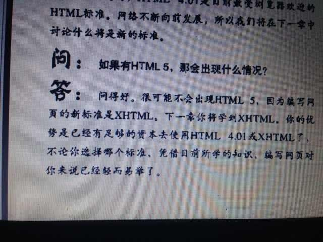

# 第一章：HTML、XML、XHTML、SGML究竟有什么区别？

如果你跟我一样，不是从上个时代走过来的前端，那么你大概率会被XML、XHTML、SGML这几个概念弄得晕头转向。

根据维基百科的定义：

> [HTML](https://zh.wikipedia.org/wiki/HTML)：超文本标记语言，是一种用于创建网页的标准标记语言。
>
> [XML](https://zh.wikipedia.org/wiki/XML)： 可扩展标记语言，是一种标记语言。
>
> [XHTML](https://zh.wikipedia.org/wiki/XHTML)： 可扩展超文本标记语言，是一种标记语言，表现方式与超文本标记语言（HTML）类似，不过语法上更加严格。
>
> [SGML](https://zh.wikipedia.org/wiki/SGML)： 标准通用标记语言，是现时常用的超文本格式的最高层次标准，是可以定义标记语言的元语言。

虽然这里的每一个字你都认识，但是合起来你就不知道他在说什么了，这就是我第一次读这几个定义的感受。

不过，标准里总有答案。

[HTML 标准](https://html.spec.whatwg.org/multipage/)的第一章，没有太多技术性的内容，主要以全局性的概括和阅读引导为主。而本章的 [第六小节](https://html.spec.whatwg.org/multipage/introduction.html#history-2) ，我认为是这一章最精彩的地方。他回顾了HTML的成长历史，讲述HTML如何从功能单薄的第一代，经过各种博弈和斗争，成长为如今羽翼丰满的HTML5。

而在这一小节里，XML、XHTML这些概念频繁出现。在阅读的过程中，我惊喜地发现，相比于生啃这些概念的教科书定义，如果从历史发展的视角，去看这一个个概念的诞生、发展、互动甚至衰落，我能够更加立体地感知到它们，脑子里原本模糊的概念一下子变得清晰起来。

本文我将会深入展开HTML标准第一章里的两个小节： [1.6 History](https://html.spec.whatwg.org/#history-2) 、[1.8 HTML vs XML syntax](https://html.spec.whatwg.org/#html-vs-xhtml) ，配合一些扩展阅读，我力求给读者捋清楚：

- 「超文本」、「标记语言」等等到底指的是什么？
- HTML、XML、XHTML、SGML分别是什么？他们是基于什么需求诞生的？他们之间的关系又是怎么样的？现实当中又有哪些应用？
- HTML的精彩纷呈的进化之路。
<br/>


### 目录:

- [历史视角看HTML](#历史视角看html)

  * [1. 标记语言的出现](#1-标记语言的出现)

  * [2. SGML的诞生：标记语言的突破性变革](#2-sgml的诞生标记语言的突破性变革)

  * [3. 第一个HTML页面的诞生](#3-第一个html页面的诞生)

  * [4. 对于SGML的简化，使得XML获得大规模的使用](#4-对于sgml的简化使得xml获得大规模的使用)

  * [5. XHTML横空出世及其野心](#5-xhtml横空出世及其野心)

  * [6. HTML的停滞与时代的纷乱](#6-html的停滞与时代的纷乱)

  * [7. 转折点](#7-转折点)

  * [8. HTML一统江湖](#8-html一统江湖)

- [结语：在DTD中看HTML的演化](#结语在dtd中看html的演化)
<br/>


## 历史视角看HTML
<br/>


### 1. 标记语言的出现

在计算机出现以前，如果想要出版一篇文章，大致的流程是这样的：


出版商拿到文章的原稿（manuscript）后，需要先进行排版。这个过程会由熟悉打印机操作的工人，以手写的方式在原稿的边缘添加标记，就跟小时候老师给你改作文差不多。经过标记后的稿件会交给印刷工人，印刷工人会根据这些标记对打印机进行操作，最后才打印出格式理想的文章。在当时，专门做这种标记工作的人也被称为「标记人（markup man）」。


而计算机出现以后，印刷工人的活可以交给计算机做了。标记人的沟通对象也从印刷工人换成了计算机，为了让计算机能够精准地按照标记人的想法进行排版，「标记语言」便诞生了。出生在21世纪的标记人会使用标记语言来指导计算机对文章进行排版，而那些专门使用HTML这个标记语言的标记人给自己换了一个更好听的名字，叫前端工程师。


<br/>


### 2. SGML的诞生：标记语言的突破性变革

在很长一段时间里，市面上流行的标记语言主要有两种：

一种类似我们现在使用的markdown，把标记符号直接嵌入到文本当中，如用`#`表示标题。计算机会从头到尾读取这些标记符号并根据提前约定好的规则来展示内容，这种标记方式也叫[过程性标记（Procedural markup）](https://en.wikipedia.org/wiki/Markup_language#Procedural_markup)。

另一种则像word一样，想要做到傻瓜式操作，所见即所得。这种标记语言一般都会隐藏在一个简单易用的图形化界面背后，你在编辑过程中所呈现的内容，就是最后打印出来的内容。这种标记方式称为[表示性标记（Presentational markup）](https://en.wikipedia.org/wiki/Markup_language#Presentational_markup)。

不过，这两种方式都存在一些问题：

1. **语义不清晰。** 比如，你给一个句子加粗，你是想表示这个句子是一个标题？还是这个句子是个关键句？又或者仅仅是为了整体文档的视觉效果？作为人类读者，你可以根据上下文来进行推断，但是计算机没有这样的智能，于是，必然导致的结果是：文档对搜索引擎不友好，对残障人士不友好，文档可读性、可维护性有待提高等等。
2. **文档样式与文档结构耦合。** 比如你写word的时候，创作、排版、调整样式三个事情是同时进行的，这实际上违背了 [关注点分离](https://zh.wikipedia.org/wiki/%E5%85%B3%E6%B3%A8%E7%82%B9%E5%88%86%E7%A6%BB) 的设计原则。

为了应对现有标记语言的这种缺失，在1980年，一种新式的标记语言， [Scribe](https://en.wikipedia.org/wiki/Scribe_(markup_language)) 出现了。 他有两个革命性的地方：第一，发明了一套赋予文档语义的语法；第二，发明了样式分离的概念。而这种标记方式也被称为[描述性标记（Descriptive markup）](https://en.wikipedia.org/wiki/Markup_language#Descriptive_markup)。

再到后来，一个哈佛法学院的老师 [Goldfarb](https://en.wikipedia.org/wiki/Charles_Goldfarb) 基于Scribe的思想，发明了SGML，如下图所示。在SGML语法上，你就已经可以看到HTML的雏形了。


显然HTML也是一种描述性标记语言，所以你明白为什么HTML提供了4种标签`b` 、`strong`、 `em`、 `mark`给你加粗；为什么代码规范常常不鼓励你写CSS内联样式。


<br/>


### 3. 第一个HTML页面的诞生

后面的故事我想大家也都猜到了。1990年，Tim Berners-Lee基于SGML设计了HTML，并发布了人类历史上[第一个HTML网页](http://info.cern.ch/hypertext/WWW/TheProject.html)，现在点进去你还能看到。

而如果你查看页面的源码，你甚至还能看到一些"上古时代"的HTML标签，比如`<NEXTED>` 。如果你好奇这些标签代表的意思，可以看Tim Berners-Lee写的第一份解释HTML的文档，[HTML tags](http://info.cern.ch/hypertext/WWW/MarkUp/Tags.html) 。


初代HTML对SGML做了一个大大的简化，只定义18个标签，并且没有DTD这种复杂的概念。但如果仅仅是简化，HTML并没什么了不起的。后面会讲到，在简化SGML这件事情上，XML是所有标记语言里做得最好的。

**而真正让HTML在众多标记语言中脱颖而出的地方，在于页面内那些蓝色的且带有下划线的词组中** 。在今天我们都知道这些叫链接，严谨一点的话叫超链接，轻轻一点就能跳转到其他的页面。这个对我们来说司空见惯、平平无奇的功能，在当时却是一个创世之举，因为他把原来的一座座信息孤岛给连接起来了，就好像电话第一次把人类连接起来了一样。通过超链接，普普通通的文本就像获得了超能力一样，变成了超文本。

于是，一些概念就很清晰了：

> 能够通过`超链接`（hyperlink）访问其他数据的文本叫`超文本`（hypertext）。
>
> 用来给超文本排版的计算机语言叫 `超文本标记语言`（Hypertext Markup Language），也就是`HTML`。
>
> 而用于实现这种信息互联的底层协议叫作`超文本传输协议`（Hypertext Transfer Protocol），也就是`HTTP`。


<br/>


### 4. 对于SGML的简化，使得XML获得大规模的使用

虽然HTML是基于SGML进行设计的，但实际上他们的赛道是不一样的。SGML想做一种元语言，基于它可以衍生出其他类型的标记语言，所以它叫「标准通用标记语言」。而HTML就是SGML的一个衍生出来的一种语言。如果用写故事来做类比，就好比SGML提供了一个写剧本的通用框架，比如「背景 - 冲突 - 发展 - 高潮 - 结局 - 感悟升华」，而基于这个框架你可以进一步发展出写喜剧的框架、悲剧的框架、爱情故事的框架、恐怖故事的框架等等，而HTML就是这其中的一种框架。

但SGML有一个致命的问题，就是难用。规则繁杂、学习成本高限制了SGML的大规模使用。于是，针对这个问题，XML出现了。XML在保持语法严谨的同时，去掉了很多SGML复杂的特性，在易用性、扩展性、严谨性之间找到了一个良好的平衡点。

但XML跟HTML不一样，它不是SGML的应用，而是直接对SGML的改良，它跟SGML是在同一个赛道的。沿用写故事的例子，就好比，XML直接修改了SGML的剧本框架，认为只需要「冲突 - 结局」就可以写出一个好故事了，你看现如今大多数的短视频剧情就是基于这样一个简单的框架。

一经落地，XML便获得了大量的采用，比如我们今天熟悉的SVG，就是XML的一个应用；又比如，[MathML(数学标记语言)](https://en.wikipedia.org/wiki/MathML) ，对应HTML里面的`<math>`标签，也是XML的一个应用，如果你想在页面写出优雅的数学公式，那你必须要弄懂它......还有很多很多其他的应用，乃至于你甚至可以为此列出一条长长的 [list](https://en.wikipedia.org/wiki/List_of_XML_markup_languages) 。


<br/>


### 5. XHTML横空出世及其野心

看到XML的蓬勃发展，使得当时负责制定HTML标准的组织，Tim Berners-Lee所领导的[W3C](https://www.w3.org/) 有了一个新的念头：把`HTML（超文本标记语言）`迁移到`XML（可扩展标记语言）`上，迁移后的语言顺理成章地名为`XHTML（可扩展超文本标记语言）`。

XHTML相比与HTML，最显著的区别就是语法更加严格。比如，在HTML中，如果你写`<p>`标签后忘了补全`</p>`，没关系的，浏览器会帮你加上的。但XHTML可不惯着你，它要求所有的标签都必须闭合的，一旦没有闭合，就会报错。我们可以直接在浏览器上运行以下xhtml的代码来看到这一点：

```html
<!--文件名：index.xhtml -->
<html xmlns="http://www.w3.org/1999/xhtml">
    <p>这是一个没闭合的段落标签
</html>
```

浏览器报错：


> PS：根据[HTML标准1.8 HTML vs XML syntax](https://html.spec.whatwg.org/#html-vs-xhtml)，想要运行xhtml代码，光声明XHTML的DTD是没用的，关键是设置`MIME type`为`application/xhtml+xml`，一种方式是把文件的后缀名改为`.xhtml`。

那XHTML比HTML有什么优势呢？W3C对此作了[专门的解释](https://www.w3.org/MarkUp/2004/xhtml-faq)，总结一下就是：

1. 降低客户端的开发成本。就像上面所说的，写HTML的容错率很高。但岁月静好，只不过是有浏览器替你负重前行。为了处理你那屎一样的代码，浏览器需要做大量的错误处理，如果都换成了XHTML了，那浏览器只需要给你报个错的就好了。
2. 能够保证不同客户端对页面展示的一致。对于HTML，不同的客户端对语法错误的处理可能会不一样；而对于XHTML，客户端只需要关注正确的展示就可以了，这同时也节省了开发者在多个的客户端进行测试的成本。
3. 可以直接对接XML庞大的生态，比如当时的HTML还不支持的SVG、MathML，以及一些XML的开发工具。

这里甚至都没有提到由于语法变严格之后，文档可维护性的提高等等诸如此类的好处。不知道你觉得怎么样，我反正是被说服了。当然，被说服的不只有我一个，当年写前端教科书的那帮人都认为XHTML才是未来：



1998年，W3C进行内部投票，决定完全停止对HTML标准（当时已经是HTML4）的改进，转而把注意力放在XHTML上，并于2000年完成了XHTML1标准的制定。


<br/>


### 6. HTML的停滞与时代的纷乱

在HTML偃旗息鼓，而被钦定的继承者XHTML尚待成熟的时期，外面的世界硝烟四起，动荡不安。

一方面，人们对“互联网”这个新兴概念可以用疯狂来形容。在1997年到2000年这段时间，只要你声称自己要创建一个互联网公司，不管多么不靠谱，都有可能拿到投资；传统公司只需要在名字上加个“.com”的后缀，公司的市值就会蹭蹭往上涨，史称[互联网泡沫](https://zh.m.wikipedia.org/zh-hans/%E4%BA%92%E8%81%AF%E7%B6%B2%E6%B3%A1%E6%B2%AB) 。

另一方面，各个浏览器厂商，深知互联网空前巨大的潜力。为了争夺市场份额，展开了激烈的竞争，史称[浏览器大战](https://zh.wikipedia.org/wiki/%E6%B5%8F%E8%A7%88%E5%99%A8%E5%A4%A7%E6%88%98)。他们急需通过各种新、奇、特的功能吸引用户，停滞的HTML标准根本不能满足他们的需求。

与此同时，W3C依旧认定XHTML是未来，自顾自地按照自己的想法来制定标准。在XHTML1完成后，W3C又开始搞XHTML2。而XHTML2更是非常大胆地完全放弃与HTML和XHTML1兼容，等同于一门新的语言。


<br/>


### 7. 转折点

事情的转折点发上在2003年，W3C发布了 [XForms](https://en.wikipedia.org/wiki/XForms) ，并称这是下一代的互联网表单。 XForms也是XML的一个应用。对于为什么要使用XForms，W3C[做了充分的解释](https://www.w3.org/MarkUp/Forms/2003/xforms-faq.html#new) ，说XForms能够做到很多（当时）HTML表单做不到的事情：

> - 实时检测用户的输入
> - 显示哪一些空格是必填，没填数据就不能提交
> - 以XML的格式提交数据
> - ...
>

从20年后的今天往回看，我们都知道，现在没人用XForms，这里所列出的功能，用HTML表单就能轻松完成。而当时的浏览器厂商也是这么想的，他们认为只需要在原有的HTML4的表单上面做一些扩展，就能够实现XForms的大部分功能，没必要重新写一套专门为XForms服务的渲染引擎。

也是从这里开始，浏览器厂商开始意识到应该沿着HTML的道路继续走，而不是用XHTML来替换它。标准里是这么说的：

> This interest was borne from the realization that XML's deployment as a web technology was limited to entirely new technologies (like RSS and later Atom), rather than as a replacement for existing deployed technologies (like HTML).
>
> 这样的想法源自于大家的一种意识：XML作为网络技术的部署只适用于新的web技术（比如RSS、ATOM），而不是现有的部署技术（如HTML）的替代品。

于是，在2004年，Mozilla和Opera就一起给W3C提议，希望重启HTML标准的制定。W3C内部投票进行了否决，理由是这与他们之前选择的道路相违背。

既然W3C不愿意做，浏览器厂商就打算自己来做。随后，Apple、Mozilla以及Opera共同创建了[WHATWG](https://whatwg.org/)，宣布自己来制定HTML5的标准。并表明他们会以几个核心原则作为标准制定的基础：一个是向下兼容；另一个是互通性（interoperablity），意味着他们会把其他几个标准整合起来，包括HTML4、XHTML1 以及DOM2 HTML。


<br/>


### 8. HTML一统江湖

到了06年，W3C已经知道让web世界从HTML切换到XML是一个艰难的事情了。Tim Berners-Lee[在他的博客中说到](https://web.archive.org/web/20070609092703/http://dig.csail.mit.edu/breadcrumbs/node/166) ：

> "The attempt to get the world to switch to XML ... all at once didn't work. The large HTML-generating public did not move ....The plan is to charter a completely new HTML group." 
>
> 让世界转向XML的尝试...没办法一下子完成。很大部分的HTML群体并没有进行迁移...我们计划重新组建一个新的HTML工作组。

在随后的很多年里，W3C都与WHATWG一起工作，一同制定HTML的标准。不过他们之间依旧存在分歧：

W3C想要按照惯例给标准一个最终版本，沿着HTML5、HTML6这样的顺序去制定标准。而WHATWG想要做一个Living Standard，摒弃版本号的概念，只要有需求时就添加新的功能，以保持灵活。

到了2019年，W3C和WHATWG签订了一个[协议](https://www.w3.org/blog/news/archives/7753) ，同意按照Living Standard的方式制定HTML标准，并把HTML和DOM标准的主要制定权移交给WHATWG。

所以，如果要抠字眼的话，现在没有什么HTML5，未来也不会有HTML6，有的只是持续进化、注定会越来越强大的HTML。


<br/>


## 结语：在DTD中看HTML的演化

在过去，如果你想写XHTML，那么你要在文件第一行放一段这样的代码，声明这是一个XHTML的文档：

```
<!DOCTYPE html PUBLIC "-//W3C//DTD XHTML 1.1//EN" "http://www.w3.org/TR/xhtml11/DTD/xhtml11.dtd">
```

这就是DTD（Document Type Definition），它是源自于SGML的一个功能，用来定义文件类型。如果你看[W3C的官网](https://www.w3.org/)的源码，现在用的依旧是在这个DTD，而不是最新标准里定义的DTD，也许这就是W3C最后的倔强吧。

HTML4也定义了三种DTD，代表不同的模式:

```
<!DOCTYPE HTML PUBLIC "-//W3C//DTD HTML 4.01//EN" "http://www.w3.org/TR/html4/strict.dtd">
<!DOCTYPE HTML PUBLIC "-//W3C//DTD HTML 4.01 Transitional//EN" "http://www.w3.org/TR/html4/loose.dtd">
<!DOCTYPE HTML PUBLIC "-//W3C//DTD HTML 4.01 Frameset//EN" "http://www.w3.org/TR/html4/frameset.dtd">
```

他们之间有什么区别其实已经不重要了，因为九九归一，在今天，我们只有一种DTD：

```
<!DOCTYPE html>
```

你可以看到，最新的DTD里面已经没有版本号了。

你可能会问，既然只有一种，为什么不直接省略掉呢？根据[HTML标准13.1.1 The DOCTYPE](https://html.spec.whatwg.org/multipage/syntax.html#the-doctype)，DTD依旧需要显示声明是为了兼容古代的HTML文件，如果你省略了这个DTD，浏览器就会切换成[quirk mode](https://en.wikipedia.org/wiki/Quirks_mode) ，以古代浏览器的渲染规则来展示HTML。


