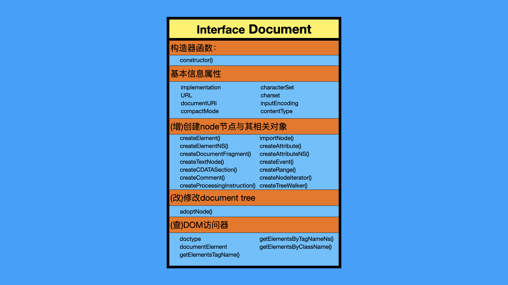
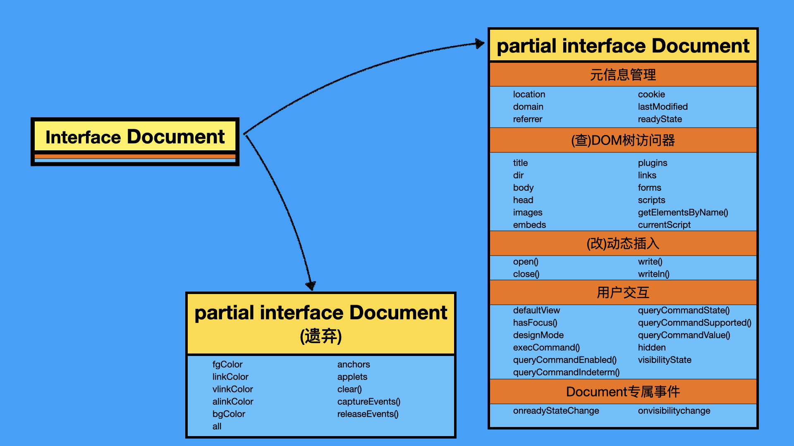
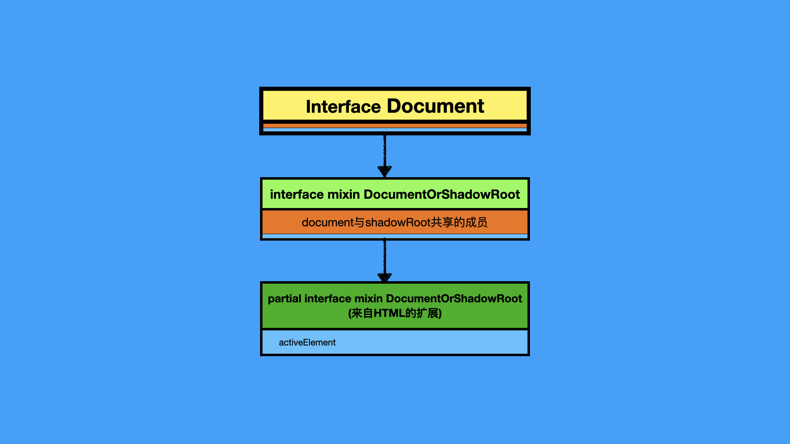
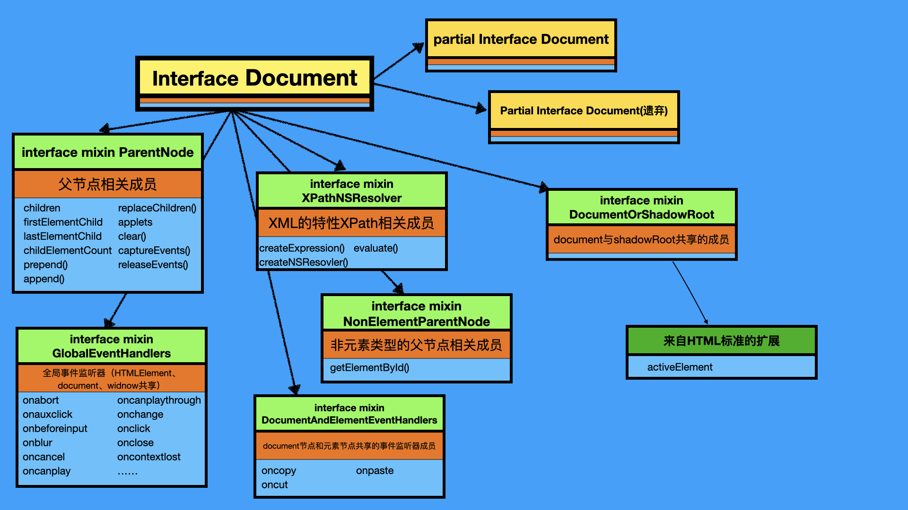

# document对象属性方法的来源

我们都知道document对象有很多的“乱七八糟”的属性方法，至于数量有多少呢？我们可以在一个空页面中运行以下代码大概计算一下：

```js
for (let _ in document) count++
console.log(count) // 281
```

在我自己本地的chrome上测试，count最后的值为281。但因为我这里用的是`for...in...`，所以281还不包括不可枚举属性以及Symbol。

如此庞大的数目，会直接把想要完整了解document对象这些属性方法的人劝退。不过，我们并不是毫无办法，**分类**是人类处理复杂问题时候的有效手段。就好比我们会用“界门纲目科属种”给数以亿计的自然界生物进行归类，如果我们能够找到一种有意义的方法，对document的这些属性方法进行拆解，这会极大地降低我们的认知成本。

而本文，我将会以web标准对document接口拆分的方式作为分类的依据，力求给你呈现：

- document对象的这些属性和方法都是从哪里来的？
- web标准之间是如何进行协作的？


<br/>


### 目录:

- [从原型链上进行分解](#从原型链上进行分解)

- [web标准对接口的“组装”方式](#web标准对接口的组装方式)

- [HTML标准与DOM标准中的「Document接口碎片」](#html标准与dom标准中的document接口碎片)

  * [对原始接口本身进行扩展](#对原始接口本身进行扩展)

  * [对接口所组合的mixin接口进行扩展](#对接口所组合的mixin接口进行扩展)

- [遍布在其他web标准/草案中的「Document接口碎片」](#遍布在其他web标准草案中的document接口碎片)

- [漏网之鱼](#漏网之鱼)

- [总结](#总结)
<br/>


## 从原型链上进行分解

对于一个HTML文档来说，document对象的原型链是这样的：

```
[Object.prototype]
  ↑
[EventTarget.prototype]
  ↑
[Node.prototype]
  ↑
[Document.prototype]
  ↑
[HTMLDocument.prototype] ← [document的实例]
```

从原型链上我们可以看到：一个document对象，跟一个HTML元素一样，本质上都是一个Node节点，只不过节点类型不同。所以document对象同时也继承了[Node接口](https://dom.spec.whatwg.org/#interface-node)上的所有属性方法。而Node接口上的属性方法，如`document.nodeType`，不属于本文的探讨范围，所以我们可以把它们先排除在外。

另一个方面，根据[标准](https://html.spec.whatwg.org/multipage/window-object.html#htmldocument)，HTMLDocument接口是一个历史遗留接口，本质上等同于Document接口。

基于以上，我们可以把注意力全部放在Document接口上，通过执行以下的代码，我们就可以看到真正属于Document接口自身的属性方法有哪些：

```js
const documentInterfaceOwnProps = Object.getOwnPropertyNames(Object.getPrototypeOf(new Document))
console.log(documentInterfaceOwnProps.length)
```

`Object.getOwnPropertyNames()`方法会遍历不可枚举的属性，但不会遍历原型链上的属性。在不同的浏览器上，得到的数组会略微不同。在我本地的chrome上，我得到的数组最终长度而231，这231个属性方法就是我们今天要研究的内容。


<br/>


## web标准对接口的“组装”方式

web标准是使用web IDL来定义一个对象的属性和方法的，这些属性方法也统称为「成员」。（如果你不了解IDL片段又或者不知道怎么读，建议先阅读我的[另一篇文章](./2.6.md)，我在那里对此作了深入的讲解。）

像document这样成员数量庞大的接口，它的定义不是在一个IDL片段里完成的，也不是在一个标准内完成的。**而是先定义好一个原始的document接口，然后给这个接口预留一些扩展点，其他的标准根据需求在这些扩展点上面进行扩展。** 所以document接口实际是被拆分成多个IDL片段，遍布在不同web标准的各个角落里。比如，以下是所有散落DOM标准和HTML标准中的「Document接口碎片」：

> - DOM标准：
>   - [原始Document接口](https://dom.spec.whatwg.org/#interface-document)
>   - [ParentNode mixin接口](https://dom.spec.whatwg.org/#parentnode)
>   - [XPathEvaluatorBase mixin接口](https://dom.spec.whatwg.org/#xpathevaluatorbase)
>   - [DocumentOrShadowRoot mixin接口](https://dom.spec.whatwg.org/#documentorshadowroot)
>   - [NonElementParentNode mixin接口](https://dom.spec.whatwg.org/#nonelementparentnode)
> - HTML标准：
>   - [Document partial接口](https://html.spec.whatwg.org/#the-document-object:document)
>   - [Document partial接口 (遗弃)](https://html.spec.whatwg.org/#Document-partial)
>   - [DocumentOrShadowRoot mixin接口](https://html.spec.whatwg.org/#documentorshadowroot)
>   - [GlobalEventHandlers mixin接口](https://html.spec.whatwg.org/#globaleventhandlers)
>   - [DocumentAndElementEventHandlers mixin接口](https://html.spec.whatwg.org/#documentandelementeventhandlers)

当你把所有web标准中的「Document接口碎片」集齐，就能召唤出一个完整的document对象。


<br/>


## HTML标准与DOM标准中的「Document接口碎片」

web IDL对一个接口进行扩展有两种方法：

1. 对原始接口本身进行扩展。
2. 对接口所组合的mixin接口进行扩展。

所有的Document接口碎片，都用通过这两种方式“组装”起来的。


<br/>


### 对原始接口本身进行扩展

因为document对象本质上是一个node节点，所以[最原始的IDL片段](https://dom.spec.whatwg.org/#interface-document)来自于DOM标准：

```web-idl
interface Document : Node {
	construtor()
	// ...
}
```

DOM标准中的原始Document接口定义了如下的成员：



通过使用web IDL中的partial接口，可以直接对原始接口进行扩展。格式如下：

```web-idl
partial interface Document {
	// ...
}
```

HTML标准中有两处使用了partial接口对Document接口进行扩展：

- [Document partial接口](https://html.spec.whatwg.org/#the-document-object:document)
- [Document partial接口 (遗弃)](https://html.spec.whatwg.org/#Document-partial)




<br/>


### 对接口所组合的mixin接口进行扩展

mixin接口的作用增加描述接口的内聚性。

比如，DOM标准定义了一个[DocumentOrShadowRoot mixin接口](https://dom.spec.whatwg.org/#documentorshadowroot)：

```web-idl
interface mixin DocumentOrShadowRoot {
};
Document includes DocumentOrShadowRoot;
ShadowRoot includes DocumentOrShadowRoot;
```

你会发现，这个接口的成员是空的，这其实是DOM标准刻意预留的扩展点。未来只要其他的web标准在`DocumentOrShadowRoot`上面进行扩展（使用`partial mixin`），新的成员就会同时放进Document和ShadowRoot这两个接口当中。比如，HTML标准里面就对`DocumentOrShadowRoot`[进行了扩展](https://html.spec.whatwg.org/#the-documentorshadowroot-interface)：

```web-idl
partial interface mixin DocumentOrShadowRoot {
  readonly attribute Element? activeElement;
};
```

所以，Document接口和shadowRoot接口也会同时有`activeElement`的属性。



在HTML标准和DOM标准中，Document接口组合的所有mixin接口如下图所示：




<br/>


## 遍布在其他web标准/草案中的「Document接口碎片」

如果你认为收集完HTML标准与DOM标准里的接口碎片就完事大吉了，那可太天真了。我把HTML标准和DOM标准定义的Document成员全部加起来，只有163个，离我们在上面算出来的231个还差很远。而剩下的成员，就真的是散落在各种各样的web标准/草案当中，有的你可能很熟悉，有的则是你从未听过的；有的已经成熟了，有的才刚刚起草。

比如，[FullScreen API标准](https://fullscreen.spec.whatwg.org/)同时对「Document接口」和「DocumentOrShadowRoot mixin接口」进行扩展，增加了控制页面全屏的API：

```web-idl
partial interface Document {
  [LegacyLenientSetter] readonly attribute boolean fullscreenEnabled;
  [LegacyLenientSetter, Unscopable] readonly attribute boolean fullscreen; // historical
	// ...
};

partial interface mixin DocumentOrShadowRoot {
  [LegacyLenientSetter] readonly attribute Element? fullscreenElement;
};
```

又比如，为了应对近年来出现越来越多不同形式的输入设备（如鼠标、触摸屏、笔等等），[Pointer event草案](https://w3c.github.io/pointerevents/#abstract)对于GlobalEventHandlers mixin接口进行了扩展，企图对不同的输入设备统一使用一种事件监听：

```web-idl
partial interface mixin GlobalEventHandlers {
    attribute EventHandler onpointerover;
    attribute EventHandler onpointerenter;
    attribute EventHandler onpointerdown;
    attribute EventHandler onpointermove;
		// ...
};
```

除此以外，还有很多很多来自其他标准/草案的成员，一图胜过千言万语，请看下图以及图后面为你准备的表格：


上图我给你总结了所有document接口关联的标准/草案，下面这张表我贴上了这些标准/草案的内容以及链接：

| 名称                                                         | 内容                                                         |
| ------------------------------------------------------------ | ------------------------------------------------------------ |
| [CSSOM草案](https://w3c.github.io/csswg-drafts/cssom/)       | 定义CSS媒体查询、CSS选择器、CSS自身相关的API。               |
| [CSSOM View Module草案](https://w3c.github.io/csswg-drafts/cssom-view/) | 定义查看document视口的API，包括通过脚本获得元素布局的位置、获得视口的尺寸以及滚动一个元素。 |
| [Pointer Events草案](https://w3c.github.io/pointerevents/)   | 为了应对近年来出现越来越多不同形式的输入设备（如鼠标、触摸屏、笔等等），该草案希望统一一种事件监听机制(Pointer event)，而不是对不同的输入使用不同的事件监听机制(Touch event、Mouse Event)来处理。 |
| [Pointer Lock草案](https://w3c.github.io/pointerlock)        | 针对特定应用程序，尤其是3D应用所设计的API。可以把鼠标锁定在一个目标上，通过拖动鼠标转换视角。 |
| [Selection API 草案](https://w3c.github.io/selection-api/)   | 定义可以灵活选择document部分内容（用于复制、粘贴或编辑）的API。 |
| [Full Screen API 标准](https://fullscreen.spec.whatwg.org/)  | 定义全屏相关的API。                                          |
| [Web Animations草案](https://w3c.github.io/csswg-drafts/web-animations-1/) | 定义了一个页面动画呈现的模型，以及操作这个模型的相关API。使用这些API可以直接操作CSS过渡、CSS动画、SVG动画。 |
| [Picture-in-Picture草案](https://w3c.github.io/picture-in-picture/#) | 定义视频窗口播放的API。                                      |
| [CSS Font Loading Modole草案](https://w3c.github.io/csswg-drafts/css-font-loading/) | 定义动态加载文字资源的相关事件与接口。                       |
| [CSS Transitions草案](https://w3c.github.io/csswg-drafts/css-transitions/) | 让CSS的值在一定时间内丝滑过渡。                              |
| [Page LifeCycle草案](https://wicg.github.io/page-lifecycle/spec.html) | 定义管理页面生命周期的相关API。                              |
| [CSS Animations草案](https://w3c.github.io/csswg-drafts/css-animations/) | 使用keyframes来管理CSS动画。                                 |
| [Text Fragment草案](https://wicg.github.io/scroll-to-text-fragment/) | 增加URL片段(fragment)的能力，使得使用片段导航的时候，可以快速强调一些地方，获取用户的注意力。 |
| [The Storage Access API草案](https://privacycg.github.io/storage-access/) | 定义iframe请求访问宿主数据的API。                            |


<br/>


## 漏网之鱼

即便你收集完所有的接口碎片，你会发现还是有一些落单的属性方法。所有的这些属性方法，可以把他们按照以下方式进行归类：

1. **legacy属性**：比如像`xmlEncoding`、`xmlStandalone`、`height`、`width`这种属性，他们存在的意义只是为了向下兼容，各大标准早就把他们剔除掉了。
2. **非标准属性**：这种属性往作为一种试验性的功能，还没进入到各种规范中。如`caretRangeFromPoint`、`onsearch`等等。
3. **浏览器差异属性：** 由于浏览器内核的差异，一些属性在命名上也有区别。比如，在chrome和safari上，有一批以`webkit`开头的属性，如`webkitFullscreenElement`。同样的API在firefox上则是以`moz`开头，如`mozFullScreenElement`。


<br/>


## 总结

本文，我给你展示了Document对象是如何像搭乐高一样一步一步地被“组装”起来的。同时，这也是各种web标准之间的一种协作方式，在可预见的未来，Document对象上的属性方法必定会越来越多。

而另一个比document对象成员数量还要多的是window对象，有上千个属性方法。不过，他的「组装逻辑」跟document接口是一样的，如果你是一个很有耐心的人，你完成可以像我这样去收集这些属性方法的来源，你的收获一定会超过你的付出！
